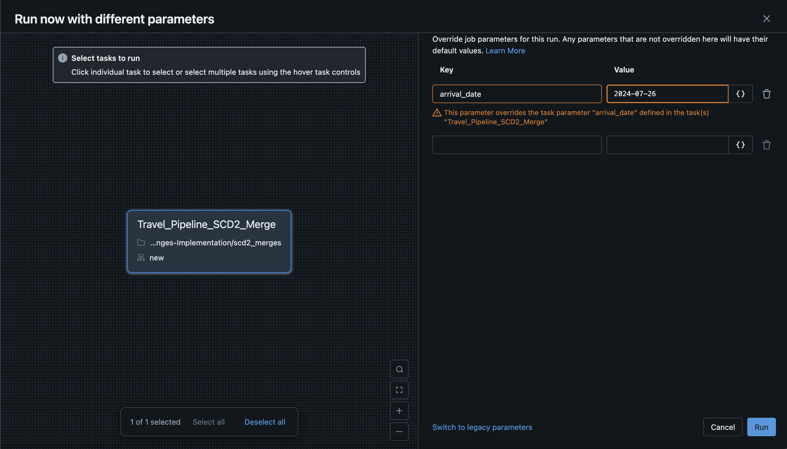
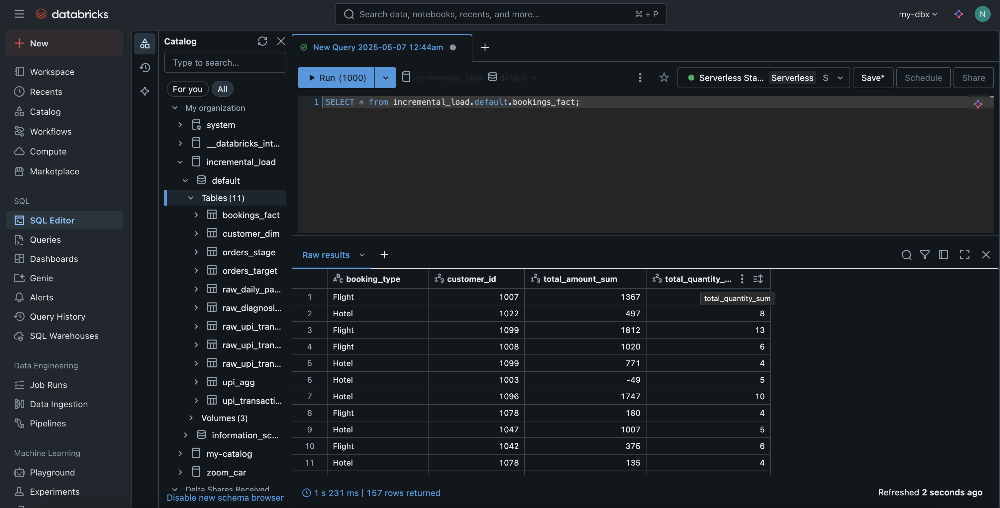
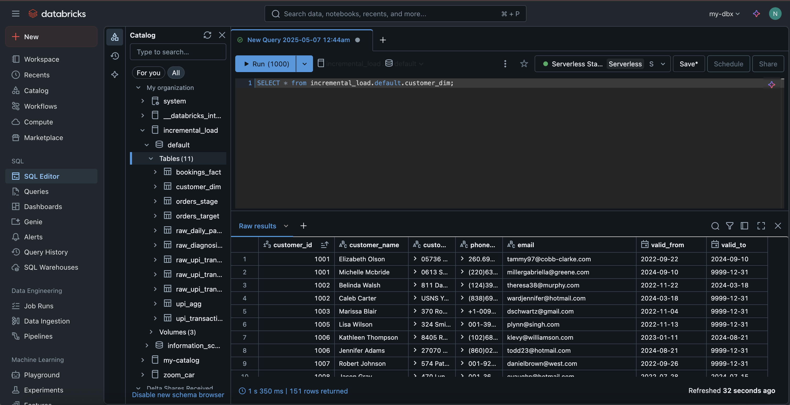
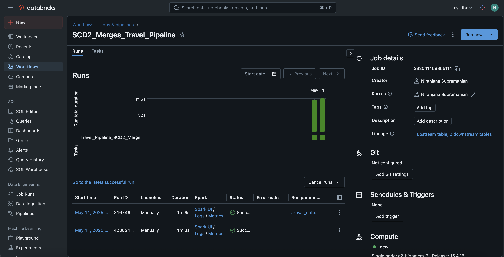

# 📊 SCD2 Merge with Delta Lake and PySpark

This project demonstrates how to implement Slowly Changing Dimensions Type 2 (SCD2) logic using Delta Lake with PySpark on Databricks. It reads incremental booking and customer data, merges it into fact and dimension tables, and maintains historical changes using Delta Lake merge operations.

---

## Project Structure

```
scd2/
├── scd2_merges.ipynb           # Main notebook with logic
├── screenshots/                # Folder with execution screenshots
│   ├── bookings_fact.png
│   ├── customer_dim.png
│   ├── pipeline.png
│   ├── param_25.png
│   └── param_26.png
└── README.md                   # Project README
```

---

## 📌 Objective

- Read incremental CSV files for bookings and customers.
- Perform SCD2 merge into:
  - **bookings_fact** (fact table)
  - **customer_dim** (dimension table)
- Use Delta Lake merge conditions to track historical data and updates.
- Automate using Databricks widgets and parameterized runs.

---

## 🔧 Setup

Make sure you have:

1. A Databricks cluster with Delta Lake support.
2. CSV data files stored in mounted volumes or GCS paths.
3. Required libraries like `pydeequ` available on the cluster.

---

## 📑 Workflow Overview

1. **Parameterization via Widgets**  
   Set arrival date dynamically:  
     
   

2. **Read Booking and Customer CSVs**  
   Located under `/Volumes/incremental_load/...`.

3. **Load Staging Tables**  
   Load data into Spark DataFrames and optionally into staging Delta tables.

4. **SCD2 Merge Logic**  
   - Match on keys like `booking_id`, `customer_id`.  
   - Update records when changed.  
   - Insert new records if not found.  
   - Mark old records as expired by setting an `end_date`.

5. **Target Tables**  
   - **bookings_fact**:   
   - **customer_dim**: 

6. **Visual Pipeline Representation**  
   

---

## 🚀 Execution

- Run the notebook end-to-end in Databricks.
- Pass `arrival_date` as widget input.
- Review target tables for updated and historical records.
